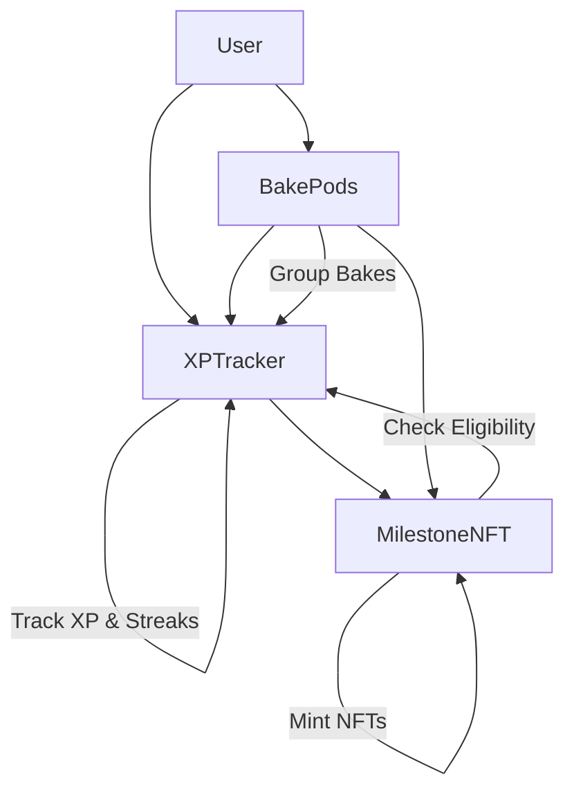

# BakeXP Smart Contracts

Smart contracts for the BakeXP platform - a gamified baking habit tracking system built on Starknet.

## Overview

BakeXP incentivizes consistent baking habits through XP tracking, streak mechanics, milestone NFTs, and group challenges. The platform runs on Starknet, leveraging Cairo smart contracts for transparent and decentralized game mechanics.

## Architecture

The BakeXP system consists of three main smart contracts:

### 🏆 XPTracker Contract
- **Purpose**: Core XP and streak tracking system
- **Features**:
  - Track user XP with configurable rewards
  - Daily baking streak calculation
  - Level progression based on XP
  - One bake per day enforcement
  - Owner-controlled XP management

### 🏅 MilestoneNFT Contract  
- **Purpose**: Achievement NFTs for reaching milestones
- **Features**:
  - OpenZeppelin ERC721 implementation
  - Automatic milestone eligibility checking
  - Multiple milestone types (streaks, levels, total bakes)
  - Integration with XPTracker for real-time verification
  - Metadata management for NFT attributes

### 👥 BakePods Contract
- **Purpose**: Group baking challenges and pod management
- **Features**:
  - Create and manage baking pods
  - Group streak tracking
  - Pod membership management
  - Collaborative milestone achievements
  - Daily participation tracking

## Contract Interactions



## Getting Started

### Prerequisites

- [Scarb](https://docs.swmansion.com/scarb/) - Cairo package manager
- [Starknet Foundry](https://foundry-rs.github.io/starknet-foundry/) - Testing and deployment tools

### Installation

1. **Clone and setup**:
   ```bash
   git clone <your-repo>
   cd BakeXP/contracts
   ```

2. **Install dependencies**:
   ```bash
   scarb build
   ```

3. **Run tests** (requires Starknet Foundry):
   ```bash
   scarb test
   ```

### Project Structure

```
contracts/
├── src/
│   ├── lib.cairo           # Module declarations
│   ├── xp_tracker.cairo    # XP and streak tracking
│   ├── milestone_nft.cairo # Achievement NFTs
│   └── bakepods.cairo      # Group challenges
├── scripts/
│   ├── deploy.ts           # TypeScript deployment script (recommended)
│   ├── setup.ts            # TypeScript setup script
│   ├── verify.ts           # Contract verification script
│   ├── utils.ts            # Deployment utilities
│   ├── types.ts            # TypeScript type definitions
│   ├── setup_account.sh    # Bash account setup helper
│   └── deploy.sh           # Bash deployment script
├── package.json           # Node.js dependencies
├── tsconfig.json          # TypeScript configuration
├── .env.example           # Environment configuration template
├── Scarb.toml             # Project configuration
├── DEPLOYMENT.md          # Detailed deployment guide
└── README.md              # This file
```

## Deployment

### Option 1: TypeScript Deployment (Recommended)

**Prerequisites:**
- Node.js (v18+)  
- Starknet account with private key
- STRK tokens for fees

**Quick Start:**
```bash
# Install dependencies
npm install

# Interactive setup
npm run setup-account

# Deploy contracts
npm run deploy
```

**Available Scripts:**
- `npm run setup-account` - Interactive account setup
- `npm run deploy` - Deploy to configured network
- `npm run deploy:sepolia` - Deploy to Sepolia testnet  
- `npm run deploy:mainnet` - Deploy to Mainnet
- `npm run verify` - Verify deployed contracts

See [DEPLOYMENT.md](./DEPLOYMENT.md) for detailed TypeScript deployment documentation.

### Option 2: Bash Deployment (Alternative)

**Prerequisites:**
1. **Install Starknet Foundry** (includes sncast CLI):
   ```bash
   curl -L https://raw.githubusercontent.com/foundry-rs/starknet-foundry/master/scripts/install.sh | bash
   starkup
   ```

2. **Set up your Starknet account**:
   ```bash
   # Create your account (replace with your actual details)
   sncast account create --name bakexp_deployer
   
   # Or import an existing account
   sncast account import --name bakexp_deployer \
     --address YOUR_WALLET_ADDRESS \
     --private-key YOUR_PRIVATE_KEY \
     --type oz
   ```

3. **Ensure you have STRK tokens on Starknet Sepolia** for deployment fees.

### Configuration

The deployment scripts use a `.env` file for configuration. Create one from the template:

```bash
cp .env.example .env
```

Edit the `.env` file with your values:
```bash
# Your Starknet wallet address (the owner of the contracts)
OWNER_ADDRESS=0x069380ac3a70c38102c8c2183a47f7741b93d61cb9dba8de595408759308b14c

# Account name in sncast (created with setup_account.sh)
ACCOUNT_NAME=bakexp_deployer

# Network to deploy to (sepolia or mainnet)
NETWORK=sepolia
```

### Quick Deploy

```bash
# Step 1: Create configuration file
cp .env.example .env
# Edit .env file with your wallet address and settings

# Step 2: Set up account (first time only)
chmod +x scripts/setup_account.sh
./scripts/setup_account.sh

# Step 3: Deploy contracts
chmod +x scripts/deploy.sh
./scripts/deploy.sh
```

**Alternative (using environment variables):**
```bash
export OWNER_ADDRESS="YOUR_WALLET_ADDRESS"
export ACCOUNT_NAME="bakexp_deployer"
./scripts/deploy.sh
```

### Deployment Architecture

The BakeXP system consists of three main contracts that must be deployed in order:

1. **XPTracker** - Tracks user XP, streaks, and baking activity
2. **MilestoneNFT** - Mints achievement NFTs for reaching milestones  
3. **BakePods** - Manages group baking challenges and pod functionality

### Deployment Steps

#### Step 1: Build Contracts

```bash
cd contracts
scarb build
```

#### Step 2: Declare Contract Classes

Declare each contract to get their class hashes:

```bash
# Set your network
export STARKNET_RPC="https://starknet-sepolia.public.blastapi.io"

# Declare XPTracker
sncast --url $STARKNET_RPC declare --contract-name XPTracker
# Save the class hash: XP_TRACKER_CLASS_HASH=0x...

# Declare MilestoneNFT  
sncast --url $STARKNET_RPC declare --contract-name MilestoneNFT
# Save the class hash: MILESTONE_NFT_CLASS_HASH=0x...

# Declare BakePods
sncast --url $STARKNET_RPC declare --contract-name BakePods  
# Save the class hash: BAKEPODS_CLASS_HASH=0x...
```

#### Step 3: Deploy Contracts (in order)

**3.1 Deploy XPTracker**
```bash
export OWNER_ADDRESS="YOUR_WALLET_ADDRESS"  # e.g., 0x123...
export XP_TRACKER_CLASS_HASH="0x..."  # From declare step

sncast --url $STARKNET_RPC deploy \
  --class-hash $XP_TRACKER_CLASS_HASH \
  --constructor-calldata $OWNER_ADDRESS

# Save the contract address: XP_TRACKER_ADDRESS=0x...
```

**3.2 Deploy MilestoneNFT**
```bash
export XP_TRACKER_ADDRESS="0x..."  # From previous deployment
export MILESTONE_NFT_CLASS_HASH="0x..."  # From declare step

sncast --url $STARKNET_RPC deploy \
  --class-hash $MILESTONE_NFT_CLASS_HASH \
  --constructor-calldata $OWNER_ADDRESS $XP_TRACKER_ADDRESS

# Save the contract address: MILESTONE_NFT_ADDRESS=0x...
```

**3.3 Deploy BakePods**
```bash
export MILESTONE_NFT_ADDRESS="0x..."  # From previous deployment  
export BAKEPODS_CLASS_HASH="0x..."  # From declare step

sncast --url $STARKNET_RPC deploy \
  --class-hash $BAKEPODS_CLASS_HASH \
  --constructor-calldata $XP_TRACKER_ADDRESS $MILESTONE_NFT_ADDRESS

# Save the contract address: BAKEPODS_ADDRESS=0x...
```

### Deployment Summary

After successful deployment, you should have:

| Contract | Purpose | Dependencies |
|----------|---------|-------------|
| XPTracker | Core XP and streak tracking | None |
| MilestoneNFT | Achievement NFTs | XPTracker address |
| BakePods | Group challenges | XPTracker + MilestoneNFT addresses |

### Configuration for Frontend

Update your frontend configuration with the deployed contract addresses:

```typescript
// In your frontend config
export const CONTRACTS = {
  XP_TRACKER: "0x...",      // XPTracker deployment address
  MILESTONE_NFT: "0x...",   // MilestoneNFT deployment address  
  BAKEPODS: "0x...",        // BakePods deployment address
};

export const NETWORK = "sepolia"; // or "mainnet" for production
```

### Verification

Test your deployment by calling some read functions:

```bash
# Test XPTracker - get XP for an address
sncast --url $STARKNET_RPC call \
  --contract-address $XP_TRACKER_ADDRESS \
  --function "get_xp" \
  --calldata $OWNER_ADDRESS

# Test MilestoneNFT - get milestones for an address  
sncast --url $STARKNET_RPC call \
  --contract-address $MILESTONE_NFT_ADDRESS \
  --function "get_user_milestones" \
  --calldata $OWNER_ADDRESS

# Test BakePods - get user pods
sncast --url $STARKNET_RPC call \
  --contract-address $BAKEPODS_ADDRESS \
  --function "get_user_pods" \
  --calldata $OWNER_ADDRESS
```

### Mainnet Deployment

For mainnet deployment:

1. Change RPC URL to mainnet: `https://starknet-mainnet.public.blastapi.io/rpc/v0_7`
2. Ensure you have sufficient ETH on Starknet mainnet
3. Use the same deployment steps but with mainnet network
4. **Double-check all addresses and parameters before deploying!**

### Troubleshooting

#### Common Issues:

1. **"Insufficient balance"** - Add more ETH to your Starknet account
2. **"Class already declared"** - Class hash already exists, you can proceed to deploy  
3. **"Constructor failed"** - Check constructor parameters match expected types
4. **"Account not found"** - Ensure your account is properly added to sncast

#### Getting Help:

- Starknet Discord: https://discord.gg/starknet
- Starknet Foundry Book: https://foundry-rs.github.io/starknet-foundry/
- BakeXP GitHub Issues: Create an issue for project-specific problems

## Contract Specifications

### XPTracker Functions

| Function | Type | Description |
|----------|------|-------------|
| `add_xp(user, amount)` | External | Add XP to user (owner only) |
| `get_xp(user)` | View | Get user's total XP |
| `log_bake(user, timestamp)` | External | Log daily bake and update streak |
| `get_streak(user)` | View | Get user's current baking streak |
| `get_level(user)` | View | Calculate level from XP |
| `get_total_bakes(user)` | View | Get total lifetime bakes |

### MilestoneNFT Functions

| Function | Type | Description |
|----------|------|-------------|
| `mint_milestone(user, milestone_id)` | External | Mint milestone NFT |
| `get_user_milestones(user)` | View | Get all earned milestone IDs |
| `has_milestone(user, milestone_id)` | View | Check if user has specific milestone |
| `check_and_mint_eligible_milestones(user)` | External | Auto-mint all eligible milestones |

### BakePods Functions

| Function | Type | Description |
|----------|------|-------------|
| `create_pod(name, target_streak, max_members)` | External | Create new baking pod |
| `join_pod(pod_id)` | External | Join existing pod |
| `leave_pod(pod_id)` | External | Leave pod |
| `log_pod_bake(pod_id)` | External | Log bake for pod |
| `get_pod_stats(pod_id)` | View | Get pod statistics |
| `get_user_pods(user)` | View | Get all pods user belongs to |

## Milestone Types

The system includes these milestone categories:

| Category | Milestones | Criteria |
|----------|------------|----------|
| **First Steps** | First Bake | Complete 1 bake |
| **Streaks** | 3, 7, 30, 100 days | Consecutive daily bakes |
| **Levels** | Level 5, 10, 25 | XP-based progression |
| **Volume** | 50, 100 total bakes | Lifetime baking count |

## XP & Level System

- **Base XP**: 100 XP per bake
- **Streak Bonus**: +10 XP per day in current streak
- **Level Formula**: `level = sqrt(total_xp / 100)`
- **Streak Rules**: 
  - Continues if baked within 48 hours of last bake
  - Resets to 1 after missed days
  - One bake per 24-hour period

## Integration with Frontend

The contracts are designed to integrate with the React frontend in `../frontend/`. Key integration points:

1. **Wallet Connection**: Use Starknet React for wallet integration
2. **Contract Calls**: Import ABIs and use dispatchers for contract interaction  
3. **Event Listening**: Subscribe to contract events for real-time updates
4. **State Management**: Cache contract data in React context/state

Example integration:
```typescript
import { useContract } from '@starknet-react/core';
import { CONTRACT_ADDRESSES } from './config';

// Read user XP
const { data: userXP } = useContractRead({
  address: CONTRACT_ADDRESSES.XP_TRACKER,
  abi: xpTrackerAbi,
  functionName: 'get_xp',
  args: [userAddress],
});

// Log a bake
const { write: logBake } = useContractWrite({
  address: CONTRACT_ADDRESSES.XP_TRACKER,
  abi: xpTrackerAbi,
  functionName: 'log_bake',
});
```

## Development

### Building

```bash
scarb build
```

### Testing

```bash
# Unit tests
scarb test

# Integration tests with Starknet Foundry
snforge test
```

### Code Style

- Use `snake_case` for function names
- Use `PascalCase` for struct names  
- Follow [Cairo style guide](https://book.cairo-lang.org/)
- Add comprehensive documentation for all public functions

## Security Considerations

- **Access Control**: Owner-only functions for XP management
- **Rate Limiting**: One bake per day enforcement
- **Input Validation**: Comprehensive parameter checking
- **State Consistency**: Atomic operations for streak/XP updates
- **Integration Security**: Careful contract-to-contract communication

## License

MIT License - see LICENSE file for details.

## Contributing

1. Fork the repository
2. Create a feature branch
3. Write tests for new functionality
4. Ensure all tests pass
5. Submit a pull request

## Support

- **Documentation**: See `/docs` for detailed technical documentation
- **Issues**: Create GitHub issues for bugs or feature requests
- **Discord**: Join the BakeXP community discord
- **Email**: Contact the team at team@bakexp.com
