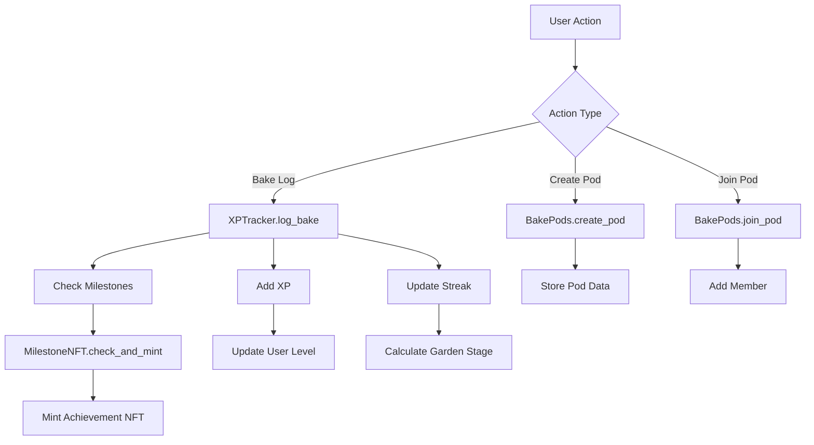

# BakeXP Platform - Complete User Flow Guide

## 🎯 Platform Overview

BakeXP is a gamified habit-building platform built on Starknet that helps users develop consistent baking habits through:
- **XP Tracking**: Earn experience points for daily baking sessions
- **NFT Milestones**: Unlock achievement NFTs for reaching goals
- **Social Pods**: Join or create baking communities with shared goals
- **Garden Progression**: Visual representation of your growth journey

## 🔄 Complete User Journey

### 1. **Initial Setup & Wallet Connection**

#### Connection Flow:
1. User visits BakeXP frontend
2. Clicks "Connect Wallet" button
3. Selects wallet (ArgentX or Braavos)
4. Authorizes connection
5. Contract services automatically initialize with user's account

#### Behind the Scenes:
```typescript
// WalletContext automatically sets up contracts
useEffect(() => {
  if (isConnected && account) {
    contractManager.setAccount(account);
    // All contract services now connected to user's wallet
  }
}, [account, isConnected]);
```

### 2. **Daily Baking Workflow**

#### User Flow:
1. **Create Bake Session**:
   - User uploads baking photo
   - Adds description and tags
   - Submits bake log

2. **Contract Integration**:
   ```typescript
   // Single function call handles multiple contract operations
   await contractManager.logBakeWithRewards(userAddress, podId?);
   ```

3. **What Happens Automatically**:
   - XP added to user's account (25 XP per bake)
   - Streak counter updated
   - Pod participation logged (if in a pod)
   - Milestone eligibility checked
   - New achievement NFTs automatically minted

#### Contract Calls Made:
```typescript
// XPTracker Contract
- xpTracker.log_bake(userAddress, timestamp)
- xpTracker.add_xp(userAddress, 25)

// BakePods Contract (if user is in pods)
- bakePods.log_pod_bake(podId)

// MilestoneNFT Contract
- milestoneNFT.check_and_mint_eligible_milestones(userAddress)
```

### 3. **XP & Progression System**

#### XP Tracking:
- **Base XP**: 25 XP per baking session
- **Streak Bonus**: Additional XP for consecutive days
- **Pod Bonus**: Extra XP for pod participation
- **Level Calculation**: `level = sqrt(xp / 100)`

#### Contract Integration:
```typescript
// Get complete user data
const userData = await xpTrackerService.getUserXPData(userAddress);
// Returns: { xp, level, streak, totalBakes, lastBakeTimestamp }
```

### 4. **NFT Milestone System**

#### How NFTs Work:
1. **Automatic Detection**: Contract monitors user progress
2. **Smart Minting**: When criteria met, NFT automatically minted
3. **On-Chain Storage**: All milestone data stored on Starknet
4. **Metadata**: Each NFT includes achievement details

#### Available Milestones:
```typescript
const milestones = [
  { id: 1, name: 'First Bake', requirement: 'Log 1 bake', rewardXP: 100 },
  { id: 2, name: 'Week Warrior', requirement: '7-day streak', rewardXP: 500 },
  { id: 3, name: 'XP Hunter', requirement: '1000 XP', rewardXP: 200 },
  { id: 4, name: 'Pod Creator', requirement: 'Create 1 pod', rewardXP: 300 },
  { id: 5, name: 'Social Baker', requirement: 'Join 3 pods', rewardXP: 400 },
  { id: 6, name: 'Century Club', requirement: '100 bakes', rewardXP: 1000 },
  { id: 7, name: 'Level Master', requirement: 'Reach level 10', rewardXP: 750 },
  { id: 8, name: 'Streak Legend', requirement: '30-day streak', rewardXP: 1500 }
];
```

#### NFT Minting Process:
```typescript
// Contract automatically checks eligibility
await milestoneNFT.check_and_mint_eligible_milestones(userAddress);

// Manual minting (admin function)
await milestoneNFT.mint_milestone(userAddress, milestoneId);
```

### 5. **Baking Pods (Social Features)**

#### Pod Creation Flow:
1. User navigates to Pods section
2. Clicks "Create Pod"
3. Fills form: name, description, target streak, member limit
4. Submits transaction

#### Contract Integration:
```typescript
// Create pod with real contract
const result = await bakePodsService.createPod(
  name,           // Pod name
  description,    // Pod description  
  targetStreak,   // Goal (e.g., 7 days)
  maxMembers     // Member limit (e.g., 50)
);
```

#### Pod Participation:
```typescript
// Join a pod
await bakePodsService.joinPod(podId);

// Log bake in pod context
await bakePodsService.logPodBake(podId);

// Get pod statistics
const stats = await bakePodsService.getPodStats(podId);
// Returns: totalBakes, memberCount, currentStreak, isActive, etc.
```

### 6. **Image Storage & NFT Metadata**

#### Current Implementation:
```typescript
// Images stored as base64 strings in localStorage
const newBake = {
  id: bakeId,
  timestamp: now,
  description,
  imageUrl,      // Base64 string or URL
  xpEarned: 25,
  tags
};
localStorage.setItem(`bakexp_history_${address}`, JSON.stringify(history));
```

#### Production-Ready Image Storage:
```typescript
// Recommended for production:
// 1. IPFS Storage
const uploadToIPFS = async (imageFile: File) => {
  const formData = new FormData();
  formData.append('file', imageFile);
  
  const response = await fetch('https://api.pinata.cloud/pinning/pinFileToIPFS', {
    method: 'POST',
    headers: { 'Authorization': `Bearer ${PINATA_JWT}` },
    body: formData
  });
  
  const result = await response.json();
  return `https://gateway.pinata.cloud/ipfs/${result.IpfsHash}`;
};

// 2. Arweave Storage (permanent)
const uploadToArweave = async (imageData: ArrayBuffer) => {
  const transaction = await arweave.createTransaction({ data: imageData });
  await arweave.transactions.sign(transaction, wallet);
  await arweave.transactions.post(transaction);
  return `https://arweave.net/${transaction.id}`;
};
```

#### NFT Metadata Enhancement:
```typescript
// Enhanced NFT metadata (stored on-chain or IPFS)
interface NFTMetadata {
  name: string;
  description: string;
  image: string;           // IPFS/Arweave URL
  attributes: [
    { trait_type: "Category", value: "Streak" },
    { trait_type: "Difficulty", value: "Beginner" },
    { trait_type: "XP Reward", value: "500" },
    { trait_type: "Unlocked Date", value: "2024-01-15" }
  ];
  external_url: string;    // Link to achievement details
  animation_url?: string;  // Optional animated version
}
```

## 🏗️ Architecture & Contract Flow

### Smart Contract Interactions:



### Frontend Integration Points:

```typescript
// Single hook provides all contract functionality
const {
  getUserXPData,
  logBakeWithRewards,
  getUserMilestones,
  createPod,
  joinPod,
  services: { xpTracker, milestoneNFT, bakePods }
} = useContracts();
```

## 🎮 Gamification Elements

### 1. **Visual Garden Progression**
- **Seed** → **Seedling** → **Sprout** → **Plant** → **Tree** → **Garden**
- Based on streak length
- Visual feedback for user engagement

### 2. **Level System**
- Mathematical progression: `level = sqrt(xp / 100)`
- Unlocks new features and titles
- Social status indicator

### 3. **Achievement System**
- 8 different milestone categories
- Automatic detection and minting
- Permanent NFT ownership
- Additional XP rewards

### 4. **Social Competition**
- Pod leaderboards
- Streak challenges
- Community milestones
- Member achievements

## 🔐 Security & Best Practices

### Contract Security:
- All functions include proper access controls
- Input validation on all parameters
- Event emission for transparency
- Emergency pause functionality

### Frontend Security:
- Wallet connection validation
- Transaction status monitoring
- Error handling for failed operations
- Rate limiting for API calls

## 🚀 Future Enhancements

### Planned Features:
1. **Recipe NFTs**: Create and trade baking recipes
2. **Video Content**: Support for baking tutorials
3. **Marketplace**: Trade achievement NFTs
4. **Governance**: DAO voting for platform features
5. **Mobile App**: React Native implementation
6. **AI Integration**: Recipe suggestions and feedback

This comprehensive system creates an engaging, gamified experience that encourages consistent habit formation while leveraging blockchain technology for verifiable achievements and social interaction. 